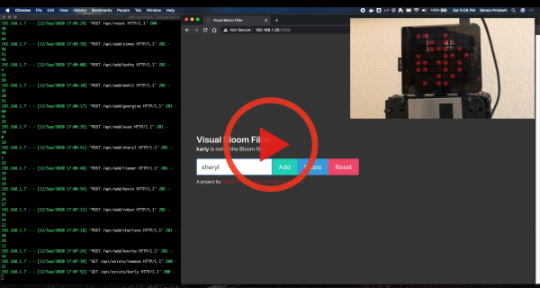

# Visual Bloom Filter

A Bloom filter implementation that uses a Raspberry Pi and a Pimoroni Unicorn Hat to store and display the status of each of the 64 bits comprising the filter.

This example is written in Python, exposes an API with Flask and uses the murmurhash3 library for hashing functions.

Here's a video demo of it working...

[](https://www.youtube.com/watch?v=iwypvxt4K0I)

## Ingredients

* [Flask](https://flask.palletsprojects.com/en/1.1.x/) (API framework).
* [Murmur3 hashing](https://pypi.org/project/murmurhash3/) (for hash functions).
* [Bulma](https://bulma.io/) (front end CSS).
* [Pimoroni Unicorn Hat library for Python](http://docs.pimoroni.com/unicornhat/).
* [Pimoroni Unicorn Hat](https://shop.pimoroni.com/products/unicorn-hat) - there is also a more expensive HD version with more pixels if you want a bigger array for your filter!
* [Raspberry Pi Model A+ v1](https://www.raspberrypi.org/products/raspberry-pi-1-model-a-plus/) (any 40 pin GPIO Pi that can take HAT boards will work, which is most of them - the model I used is long obsolete I just had one kicking around).
* [USB wifi dongle for Raspberry Pi](https://www.adafruit.com/product/814) (A doesn't come with built in wifi - other models have this onboard - find these USB dongle on Amazon or eBay just make sure to get one that is known to work with the Pi / Raspbian OS).
* [Adafruit Smoked Plastic Pi case](https://www.adafruit.com/product/2361) - get the separate smoked lid too as this is what acts as a nice LED diffuser.  This is the case for A sized Pi models, they also sell them for the larger Pi models.

## Resources

* [GeeksforGeeks article on Bloom filters in Python](https://www.geeksforgeeks.org/bloom-filters-introduction-and-python-implementation/).
* [JavaScript Bloom filter implementation with visualization](https://www.jasondavies.com/bloomfilter/).

## Installation and Setup

Make sure you're using Python 3 (I tested this with 3.8).

```bash
$ git clone https://github.com/simonprickett/visual-bloom-filter-for-pi.git
$ cd visual-bloom-filter-for-pi
$ python3 -m venv venv
$ . venv/bin/activate
$ pip install -r requirements.txt
```

### Hardware

* Connect the Unicorn hat to all 40 GPIO pins on the Pi.
* Install Raspbian / Raspberry Pi OS and configure it for your wifi, or plug it into a wired network.  Make sure you turn on SSH so you can ssh into the Pi from other computers on your network.
* If, like mine, your Pi needs a wifi dongle, plug that into a USB port and configure as needed.
* Make a note of the Pi's IP address.

### Software

The project has two main components, a backend / API written in Python using [Flask](https://flask.palletsprojects.com/en/1.1.x/), and a front end written in vanilla JavaScript using [Bulma](https://bulma.io/) CSS.  There's no build step required for the JavaScript and nothing to `npm install` :)

#### Flask Application

The Flask application code is all in `app.py`, and exposes an API with these endpoints:

* `POST /api/add/<element>` - add an element to the Bloom filter.  Always returns a 201 response.
* `GET /api/exists/<element>` - returns `True` if the element might be in the Bloom filter (remember we can't be sure) or `False` if it isn't (we can be sure of this).
* `POST /api/reset` - removes all elements from the Bloom filter and starts a fresh one.
 
The application also has a route `GET /` that serves the front end as a static HTML / JavaScript / CSS page.

I start off by defining some constants, initializing Flask and configuring the Unicorn hat so that LED 0, 0 is in the top left hand corner according to the way I have the Raspberry Pi oriented... I then get the size of the Unicorn Hat (Pimoroni make other models that have different sizes and I wanted to make the code pretty generic).

The utility function `get_led_position` translates a number into its equivalent row and column position on the LED matrix for the Unicorn Hat.  So, 10 for example would be row 1, column 1 for an 8 x 8 Unicorn Hat where the rows and columns are both 0 - 7 inclusive.

Function `toggle_leds` accepts a list of LED positions, and two RGB color tuples.  One of these, `transition_color` is used as an interim color to show which LED is toggling.  The other, `new_color` is the color that each LED will be left showing when the function finishes.  This function gets the current color for each LED, then toggles between that and `transition_color` as many times as `NUM_TRANSITIONS` specifies, then sets each LED to the color specified in `new_color`.  This is used to provide a visual effect around setting and querying bits in the Bloom filter.

Function `query_led_status` uses `get_led_position` to work out the position of the LED to query, then toggles it for visual effect, before checking whether or not the LED was off (RGB 000) or on (RGB anything other than 000).  Returns `True` if the LED was on (representing the bit in the Bloom filter being set) or `False` if the LED was off (representing the bit in the Bloom filter being unset).

Function `set_led_status` takes a list of LED numbers, works out the position of each on the Unicorn Hat, adding that to a new list `led_positions`.  The LED at each position in the list is then turned on using the `toggle_leds` function for visual effect.  This is set individual bits in the Bloom filter.

Function `add_to_filter` adds the supplied `element` to the Bloom filter.  It does this by running `element` through `NUM_HASH_FUNCTIONS` hash functions that come from Murmur3.  The result of each hash is modded by the number of LEDs in the Unicorn hat to give a LED number representing that hash result.  These results are stored in a list that is passed to `set_led_status` to change the status of the correponding LEDs.

Function `exists_in_filter` runs the value in `element` through the hash functions, checking if the LED associated with the hash from each is on or off.  It does this by using the `query_led_status` function.  As soon as one is found to be off (unset in the Bloom filter) the function returns `False`.  If all LEDs that `element` hashes to are on, the function returns `True`.

Function `reset_filter` flashes all of the LEDs on and off twice, then turns them all off.  As the state of each LED is used to represent a bit in the Bloom filter, this clears the filter.

The rest of the code defines API routes that Flask uses, and calls the appropriate function to process each route.  In the case of `/`, I simply respond with the `homepage.html` template to serve the front end.

#### JavaScript / Bulma Front End

The front end is a single HTML page (`templates/homepage.html`) that works together with a single JavaScript file `static/app.js`.

The vast majority of the styling comes from Bulma (`static/bulma.min.css`) with a tiny bit of link styling in `static/app.css`.  

Here's how it all works, focusing on the JavaScript:

* The application runs on the `window.onload` event.
* Click handlers are added to each of the Add, Exists and Reset buttons.
* The click handlers for Add and Exists, use the same function: `buttonClicked`, but pass different parameters to it.
* The function `buttonClicked` checks that text was entered in the text input, and which button was pressed (Add or Exists).  If text was entered, it then calls `callBloomFilter` to handle interaction with the Flask backend via the API.
* The function `callBloomFilter` calls the appropriate API endpoint using the Fetch API to either add an element to the Bloom filter, or check if the Bloom filter things an element exists.  It updates the page with the result of this operation, and clears the text input field.
* The Reset button click handler clears out any text in the input text box, makes a `POST` request to the Flask Application's `reset` endpoint and displays a success or error message depending on the status code returned by the API.
* The utliity function `displayErrorCallingBackendMessage` is used to display any errors from failed API calls.
* The utility function `getResult` is used to pull the `result` object from a Fetch API response.
* All DOM element IDs referred to in the JavaScript can be found in `templates/homepage.html`.
* All CSS classes referred to in the HTML are defined in `static/bulma.min.css` (easier to use the [Bulma documentation](https://bulma.io/documentation/)) or in `static/app.css` for one case where I wanted to override some link styling in Bulma.

## Starting the Application

Because of the way the Unicorn Hat library accesses the hardware, this needs to run as root, so:

```bash
$ sudo bash
# . venv/bin/activate
# flask run --host=0.0.0.0
```

Be sure to specify `--host=0.0.0.0` when starting Flask, so you can access the front end from other machines on your local network.

## Starting the Application on Boot with systemd

I included `bloomfilter.service` in the repo - this is a systemd configuration file that can be used to start the Bloom filter code when the Pi boots, so it becomes a real Bloom filter appliance.  

If you need help with configuring a systemd service on a Pi, check out [this article](https://simonprickett.dev/writing-a-systemd-service-in-node-js-pi/) I wrote.

Note that in my service file, I set:

```
TimeoutSec=90
```

This is because the Pi Model A is quite slow, so takes a while to start the Flask application.  This makes sure that systemd doesn't think it's failed and tries to restart it before it had the chance to start the first time.

## Using the Application's Front End

To get to the application's front end, point your browser at `http://<pi ip address>:5000/`.

Once the page has loaded, you can use the "Add" button to add a new entry to the Bloom filter, "Exists" to see if an entry might be in the Bloom filter and "Reset" to clear all bits in the Bloom filter.

## Using the Application's API

### Add an Element to the Bloom Filter

**Request:**

```bash
$ curl --location --request POST 'http://<pi ip address>:5000/api/add/frederick'
```

**Response:**

```json
{
    "result": true
}
```

Response will always be `true`.  Return code is always 201.  The LEDs will indicate which bits in the Bloom filter your new element hashed to.

### See if an Element Exists in the Bloom Filter

**Request:**

```bash
$ curl --location --request GET 'http://<pi ip address>:5000/api/exists/robert'
```

**Response:**

```json
{
    "result": false
}
```

Remember that this is a **probabalistic** data structure, so a response of `false` means the element is definitely not there, and `true` means it might be there.  Return code is 200.

The LEDs will change color to indicate which bits in the Bloom filter are queried.  This will fail "fast" so the first bit checked and found unset will stop the process and return `false`.

### Reset the Bloom Filter

**Request:**

```bash
$ curl --location --request POST 'http://<pi ip address>:5000/api/reset'
```

**Response:**

```json
{
    "result": true
}
```

Response will always be `true`.  Return code is 200.  All LEDs will flash blue to indicate the Bloom filter has been reset, then all of the LEDs will turn off until you add new elements to the new filter instance.

## Other Notes

This implementation is case sensitive, so "Simon", "SIMON", and "simon" will be considered different entries.
